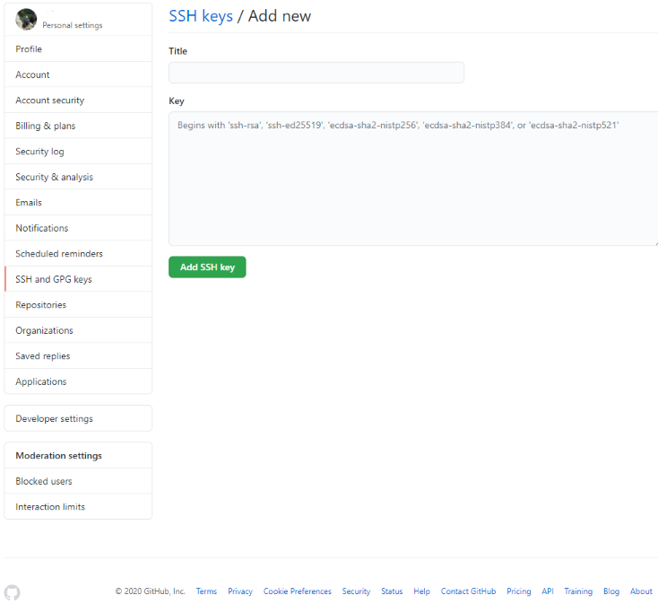

# Managing multiple GitHub account
A quick guide on how to manage multiple github accounts on windows 10 (2 accounts as an example here) using git bash. Three main steps:
* Generate SSH keys
* Add public keys to github accounts
* Create configuration file

## Generate SSH keys
First we generate SSH keys into ~/.ssh directory for the two github accounts:
* Change directory to your home/.ssh dir:
```bash
cd ~/.ssh
```
* Create an SSH key of type **rsa** for the first account, linking your github email address:
    ```bash
    ssh-keygen -t rsa -C "email.firstaccount@gmail.com"
    ```
    At the prompt '***Enter file in which to save the key***', enter the name of a file you want to save the SSH key into, e.g. **firstaccount-username-ssh**. Name the file as you want, but it make sense to name the file after the guthub username. Both a private and public keys (.pub) are generated.

    Don't enter any passphrase, just hit enter.
* Follow the same process to reate an SSH key of type **rsa** for the second account, linking your github email address:
    ```bash
    ssh-keygen -t rsa -C "email.secondaccount@gmail.com"
    ```
## Add the public keys to the github accounts
The public part of the SSH keys must be added to the github account. Let's go through the process for the first github account:
* Log in to the first github account, and navigate to Settings -> SSH and GPG keys
* Open the public key file for this account with a text editor, and copy the content of the file. Exit the text editor
* Then select the "**New SSH key**" button and paste the content that has been copied into the **Key** section.
* Give a title to the SSH keys for your reference in the **Title** section.

    

***Repeat this procedure for the second github account***

## Create a configuration file
Finally we create a configuration file into the ~/.ssh directory:
* Change directory to your home/.ssh dir:
* Use a text editor to create content similar to below example, and save it to a file name **conf**:
    ```bash
    # GitHub firstaccount
    Host github.firstaccount-username
        HostName github.com
        User git
        IdentityFile ~/.ssh/firstaccount-username-ssh

    # GitHub secondaccount
    Host github.secondaccount-username
        HostName github.com
        User git
        IdentityFile ~/.ssh/secondaccount-username-ssh
    ```
    The name chosen for ***Host*** can be anything, i.e. it does not have to be the same as the github username or SSH filename.

    However, the name of the ***IdentityFile*** is important and obviously **must** be the name of the SSH file.

## Verify GitHub recognises the keys
Using **ssh -T** followed by the name associated to **Host** in the **conf** file, e.g.:
```bash
ssh -T github.firstaccount-username
```
The following message should be displayed:
```text
Hi firstaccount-username! You have successfully authenticated, but GitHub does not provide shell access.
```

## Link a repository to one GitHub account
Finally when cloning/creating a repository locally, use:
```bash
git remote add origin git@github.firstaccount-username:repository-path.git
```
with ***repository-path.git*** being anything after ***https://github.com/*** !
