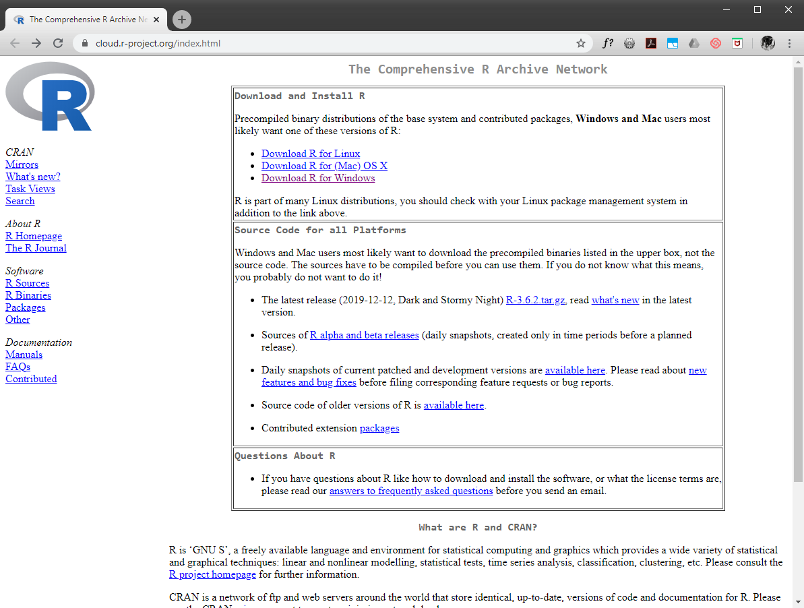
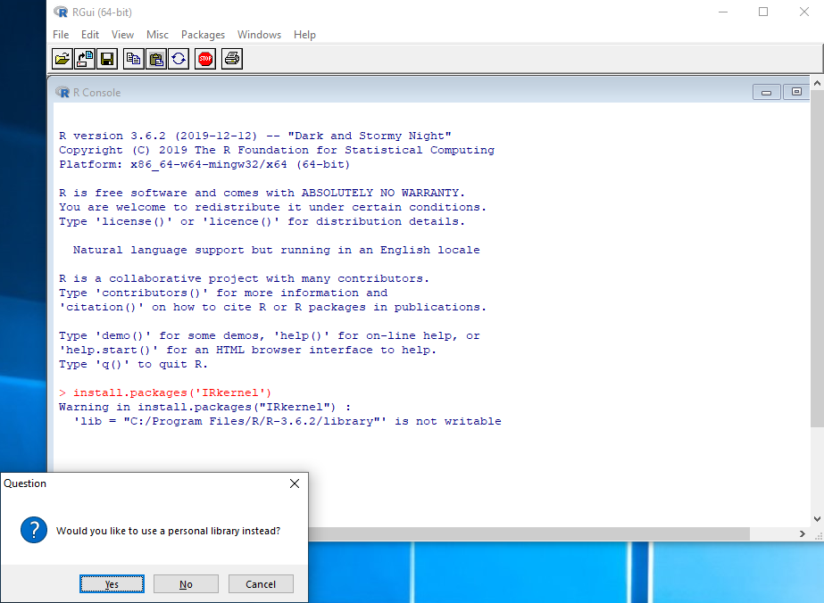
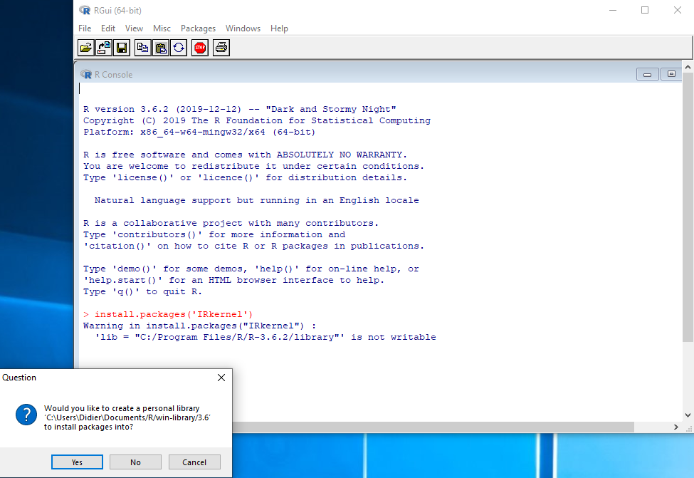
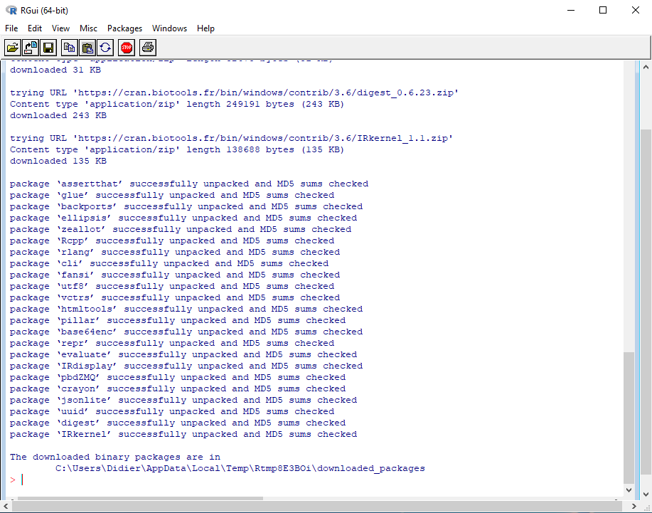
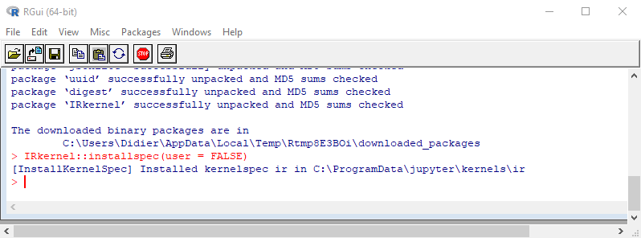
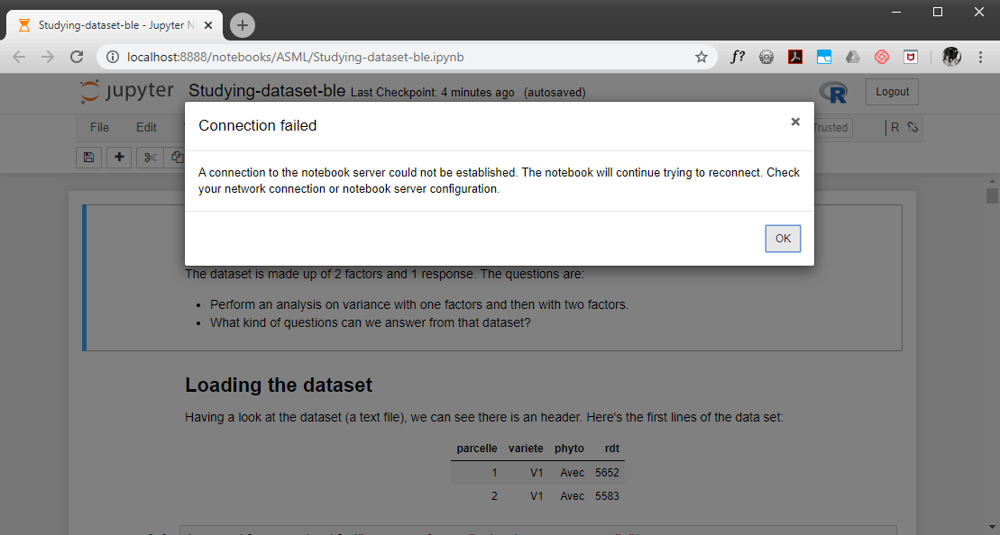
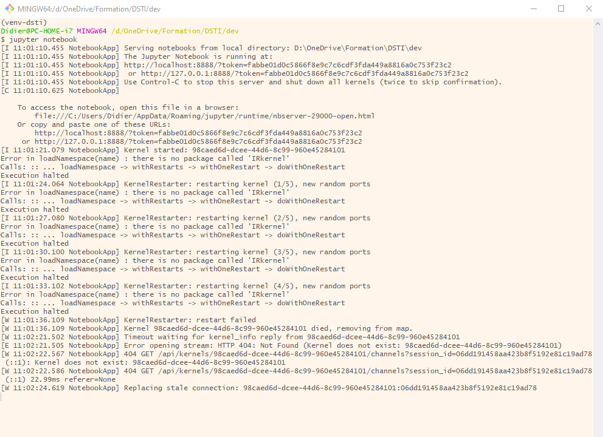

# Installing R on Jupyter notebook
This simple guide describes how to install R kernel on Jupyter notebook on Windows 10, without Anaconda.

**Assumptions**:
* '*Pure*' Python 3 (no Anaconda). *This guide has been written with Python 3.7.6*.
* Jupyter notebook already installed.

## Download and install R
Binary distributions of R packages (Linux, Mac OS X, and Windows) are available at the Comprehensive R Archive Network (**CRAN**). Download R for Windows from [here](https://cloud.r-project.org/index.html) and install.


**Remark**: *Important to install R and **not** R-Studio*

## Install R Kernel for Jupyter notebook
Jupyter notebook kernels are processes that run interactive code in a particular programming language. **IRkernel** is an R kernel for Jupyter notebook.

The R Kernel can be installed from the R Console:
* **Step-1**: Start the R Console (from R Windows shortcut created during installation. Then:
    ```shell
    install.packages('IRkernel')
    ```
* **Step-2**: By default, installation of R happens on C:\Program Files, in which one will not have rights to install R packages. I.e. the following warning displays:
    
    Select **Yes**
* **Step-3**: Then select the default suggested library path for R packages, or specify one. Here, we accept the default, i.e. select **Yes**.
    
* **Step-4**: R then starts installing the **IRkernel** packages and all its dependencies. The final installation output will look something similar to:
    
* **Step-5**: We need to make the **IRkernel** available to Jupyter notebook. This is done by installing the Kernel spec system-wide with:
    ```shell
    IRkernel::installspec(user = FALSE)
    ```
    
* **Step-6**: Last step is to update the ***kernel.json*** file to add the .libPaths command, so that Jupyter notebook has the right path to start the **IRkernel**. The *IRkernel::installspec* command has returned the path where the ***kernel.json*** has been installed, i.e. here in ***C:\ProgramData\jupyter\kernels\ir***.
    The file looks like:
    ```json
    {
        "argv": [
            "C:/PROGRA~1/R/R-36~1.2/bin/x64/R",
            "--slave",
            "-e",
            "IRkernel::main()",
            "--args",
            "{connection_file}"
        ],
        "display_name": "R",
        "language": "R"
    }
    ```
    Edit the file with a text editor and replace:
    ```shell
    "IRkernel::main()"
    ```
    by:
    ```shell
    ".libPaths('YOUR_PERSONAL_LIBRARY_PATH');IRkernel::main()"
    ```
    where **YOUR_PERSONAL_LIBRARY_PATH** is the library path chosen at **Step-3**, i.e. here: **C:/Users/Didier/Documents/R/win-library/3.6**.

**Remark**: **Step-6** is one way (*might be not the nicest*) of fixing a default issue (at least on windows) where, with the default/simple installation of R, jupyter notebook does **not** find the path to start **IRkernel**. Other ways could be investigated such as using R environment variables, such as **$R_LIBS_USER** or **$R_LIBS_SITE**.

This issue materialises as the following errors in the notebook:



And the following error in the jupyter console output:


